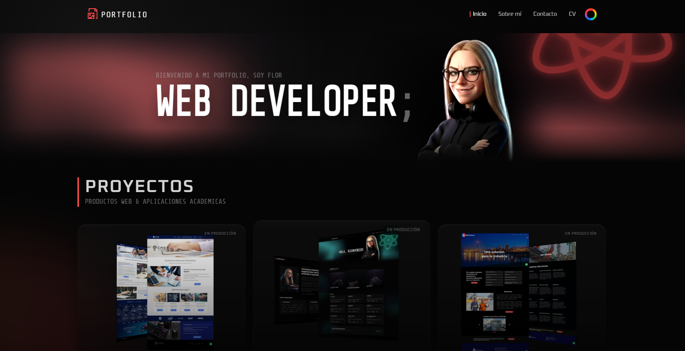

# Portfolio Web

Una plataforma de portfolio interactiva y de alto rendimiento construida con **React 19** y **Vite**, que implementa un sistema de diseño dinámico personalizado y una arquitectura orientada a servicios.

---

## 📸 Preview


---

## 🚀 Demo en Vivo

👉 **Ver Demo:**
https://floralar.github.io/portfolio/#/

---

## 📖 Descripción General

Este proyecto es una **Single Page Application (SPA)** diseñada para mostrar proyectos personales mediante una experiencia moderna, interactiva y altamente optimizada.

### Características principales

* ⚡ **Arquitectura SPA:** Navegación rápida del lado del cliente usando React Router 7.
* 🎨 **Sistema de diseño dinámico:** Cambio de tema en tiempo real mediante CSS Custom Properties y React Context.
* 🧊 **UI interactiva:** Componentes con seguimiento del mouse y estética *Glassmorphism* sin librerías UI externas.
* 🧩 **Capa de servicios:** Obtención de datos desacoplada con caché en memoria para optimizar rendimiento.
* 📱 **Responsive Engineering:** Enfoque mobile-first con tipografía fluida y layouts escalables.

---

## 🧰 Stack Tecnológico

**Core**

* React 19
* JavaScript (ES6+)

**Estilos**

* CSS Vanilla
* CSS Custom Properties (Variables)
* Flexbox & Grid

**Routing**

* React Router DOM v7 (HashRouter compatible con GitHub Pages)

**Gestión de Estado**

* React Context API (Tema / Paleta)
* Hooks locales

**Interactividad**

* Vanilla Tilt
* React Icons
* Hooks personalizados de seguimiento del mouse

**Tooling**

* Vite
* ESLint

---

## 🏗️ Arquitectura

El proyecto sigue una estructura modular y jerárquica enfocada en la separación de responsabilidades y la reutilización de componentes:

```
src/
├── components/
│   ├── ui/         # Componentes atómicos sin estado
│   ├── layout/     # Estructura general (Header, Footer, Nav)
│   ├── features/   # Lógica de dominio (Projects, Filters, Cards)
│   └── sections/   # Bloques principales de páginas
├── context/        # Estado global (temas)
├── hooks/          # Lógica reutilizable
├── services/       # Abstracción de datos/API
├── pages/          # Vistas asociadas al routing
└── styles/         # Tokens del design system y resets globales
```

---

## ✨ Funcionalidades Clave

* 🎨 **Controlador dinámico de paleta:** Modificación de colores en tiempo real con persistencia en `localStorage`.
* 🗂️ **Ecosistema de proyectos:** Separación entre proyectos destacados y académicos con vistas detalladas.
* 🎬 **Hero interactivo:** Gestión inteligente de video y estado persistente entre navegaciones SPA.
* 📱 **Navegación adaptativa:** Sistema híbrido desktop/mobile con menú hamburguesa personalizado.
* 🖱️ **Superficies reactivas:** Elementos UI que responden a coordenadas del mouse mediante variables CSS dinámicas.

---

## 🧠 Decisiones de Ingeniería

### CSS Vanilla sobre Frameworks

Se eligió CSS puro para mantener un sistema de diseño sin overhead en runtime, permitiendo manipular variables CSS directamente desde JavaScript sin re-renderizar el DOM completo.

### Manejo de datos orientado a servicios

La obtención de datos se abstrae en `projectsService.js`, implementando un caché singleton en memoria para evitar múltiples requests durante la sesión.

### Implementación de HashRouter

Garantiza compatibilidad total con hosting estático (GitHub Pages) sin configuraciones adicionales del servidor.

### Desacoplamiento lógica-componente

Los efectos visuales se encapsulan en hooks personalizados (`useMouseTracking`), permitiendo volver interactivo cualquier componente fácilmente.

---

## ⚡ Performance & UX

* 🖼️ **Estrategia de fallback de assets:** Video en Hero con imagen alternativa para conexiones lentas o dispositivos móviles, mejorando el LCP.
* 🔤 **Tipografía fluida:** Uso de `clamp()` y `rem` para escalar entre 320px y 1920px sin exceso de media queries.
* 🚀 **Optimización de eventos:** Actualización mediante variables CSS para aprovechar el compositor del navegador y reducir bloqueos del main thread.

---

## 🚀 Getting Started

### Prerrequisitos

* Node.js (LTS recomendado)
* npm

### Instalación

```bash
git clone https://github.com/florAlar/portfolio.git
cd portfolio
npm install
```

### Desarrollo

```bash
npm run dev
```

### Build de Producción

```bash
npm run build
```

---

## 📜 Scripts Disponibles

| Script            | Descripción                      |
| ----------------- | -------------------------------- |
| `npm run dev`     | Inicia el servidor de desarrollo |
| `npm run build`   | Genera el build optimizado       |
| `npm run preview` | Previsualiza el build localmente |
| `npm run lint`    | Ejecuta ESLint                   |

---


## 📄 Licencia

Este proyecto se distribuye bajo la licencia MIT.
Puedes usarlo como referencia para tu propio portfolio personal.

---

## 👩‍💻 Autor

**Flor Alarcos**

* GitHub: https://github.com/florAlar
* LinkedIn: https://www.linkedin.com/in/floralarcos/

---
